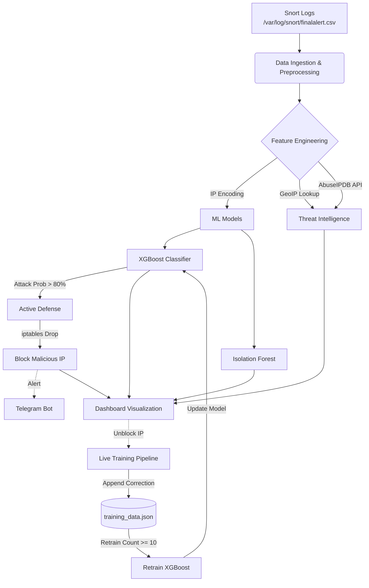

# Real-Time Attack Detection & Response System

## Overview

This system is a comprehensive security tool designed to detect network intrusions in real-time. It processes network traffic logs, enriches them with threat intelligence, analyzes them using dual machine learning models, and takes automated defensive actions.

## System Architecture



## Detailed Pipeline Workflow

### 1. Data Ingestion & Live Monitoring

The system continuously monitors Snort logs (`/var/log/snort/finalalert.csv`) every 5 seconds.

### 2. Feature Engineering & Threat Intel

- **Features**: Extracts 11 key network features (Ports, TTL, Length, etc.).
- **Intelligence**: Enriches data with **GeoIP** (Country) and **AbuseIPDB** (Reputation Score).

### 3. Dual-Model Analysis

- **XGBoost**: Primary classifier (Attack vs Normal).
- **Isolation Forest**: Anomaly detection for unknown threats.

### 4. Active Defense & Notifications

- **InfoSec Response**: If Attack Probability > 80%, the IP is blocked via `iptables`.
- **Telegram Alert**: A real-time message is sent to your configured chat with attack details.

### 5. Self-Learning (Live Training)

The system improves over time through user feedback:

- **Correction**: When an admin clicks **"Unblock"** on the dashboard, the system learns that the traffic was actually "Normal".
- **Retraining**: After collecting **10 corrections**, the system automatically retrains the XGBoost model to prevent future false positives.

### 6. Interactive Dashboard (Dash/Plotly)

A web-based interface (accessible at `http://localhost:8050`) provides real-time visibility:

- **Live Traffic Table**: Shows recent packets with their ML classification and threat scores.
- **Blocked IPs Management**: Allows administrators to view and manually unblock IPs.
- **Visual Analytics**:
  - **Confusion Matrix**: Evaluates model performance.
  - **World Map**: Visualizes the geographical distribution of attacks.
  - **Attack vs. Normal Bar Chart**: Displays traffic distribution.

## Configuration & Setup

### 1. Dependencies

- **Python Libraries**: `pandas`, `numpy`, `dash`, `xgboost`, `scikit-learn`, `requests`, `geoip2`, `joblib`, `python-dotenv`.
- **System**: `sudo` access for `iptables`.

### 2. Environment Variables (.env)

Create a `.env` file in the root directory:

```env
TELEGRAM_BOT_TOKEN=your_bot_token
TELEGRAM_CHAT_ID=your_chat_id
ABUSEIPDB_API_KEY=your_api_key
```

### 3. Files

- `attack_detection.py`: Main application.
- `live_training.py`: Self-learning module.
- `training_data.json`: Stores user corrections (auto-created).
- `xgboost_model_binary.json`: The active AI model.

## Usage

Run the application using Python:

```bash
sudo python attack_detection.py
```

_Note: `sudo` is required for the automated IP blocking functionality to work._
